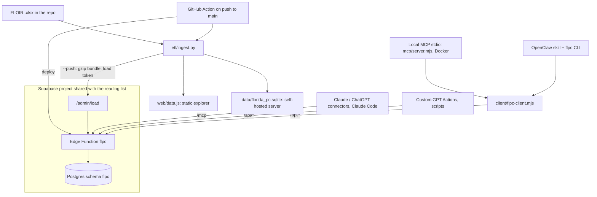

# How the Florida P&C data API works

Updated September 25, 2026. This is the technical reference for maintaining the
hosted API. Use [SUPABASE.md](SUPABASE.md) for setup, [INTEGRATIONS.md](INTEGRATIONS.md)
to connect Claude, ChatGPT, OpenClaw and other clients, [API.md](API.md) for the tool
reference and the self-hosted Docker server, and the [README](../README.md) for the
static explorer.

## The purpose

FLOIR publishes Florida residential market-share workbooks every quarter, by company
and policy type. The ETL turns them into one tidy dataset. The API lets any LLM
answer questions from that dataset with a few cheap tool calls: rankings, market
share, trends, which carriers or policy types drove a change, and carrier profiles.
It never averages ratios or treats a suppressed cell as zero.

## Runtime and data flow



The hosted API is a Supabase Edge Function (Deno, TypeScript) in the existing
free-tier project that also serves the reading list. Its data lives in a separate
Postgres schema, `flpc`. The function connects to Postgres directly through
`SUPABASE_DB_URL`, so the schema never has to be exposed through the project's REST
API. The reading list's anon and authenticated keys cannot reach it.

The Python server in `api/` (FastAPI + MCP over SQLite, Docker) is kept as the
self-hosted/offline option. Both engines answer identically, and CI enforces that
(see Verification).

## One API, four channels

`supabase/functions/_shared/flpc/operations.json` is the operation catalog: 8 tool
names, descriptions and JSON Schemas. Everything reads it:

| Channel | Code | Path to the engine |
|---|---|---|
| Remote MCP (Streamable HTTP, stateless JSON) | `mcp.ts` | `POST /mcp` → `runOperation` |
| REST + OpenAPI 3.1 | `server.ts`, `openapi.ts` | `/api/<tool>` → `runOperation` |
| Local MCP (stdio, official SDK) | `mcp/server.mjs` | shared client → REST |
| OpenClaw skill + CLI | `openclaw/` | shared client → REST |

Domain logic runs only in the function. The local MCP server and the CLI are thin
clients over REST and hold no database credentials. Requests carry
`X-FLPC-Channel`, which appears in the function logs.

`tools.ts` validates arguments against the catalog before running a tool. It coerces
types (REST query strings arrive as text), maps near-miss names (`company` →
`companies`) and rejects unknown names with the list of valid ones. A misspelled
filter must never silently widen an answer to the whole market.

## Where to change things

| File or directory | Responsibility |
|---|---|
| `etl/ingest.py` | Workbook parsing (header-text column mapping, suppressed cells, Total-row checksums), `store_tables()` shared by the SQLite writer and the upload bundle, `--push` |
| `config/carrier_groups.csv` | NAIC → parent group mapping |
| `supabase/flpc.sql` | Schema, token functions, `load_bundle()`, `flpc_reader` role and grants (idempotent; run in the SQL Editor) |
| `supabase/functions/flpc/index.ts` | Deno entry: connections and environment |
| `_shared/flpc/server.ts` | Routes, token check, scopes, CORS, data load, request logging |
| `_shared/flpc/engine.ts` | Tool implementations: filters, entity resolution, aggregation, formatting of every table |
| `_shared/flpc/metrics.ts` | Base and derived metric registry, aliases |
| `_shared/flpc/catalog.ts` | `get_catalog` text: caveats and the drill-down workflow |
| `_shared/flpc/fmt.ts` | Result tables, CSV/JSON rendering, Python-exact rounding |
| `_shared/flpc/store.ts` | Dimension cache (periods, companies, groups, policy types), reload on a new `load_id` |
| `_shared/flpc/auth.ts` | Token hashing, lookup cache, `last_used_at` |
| `_shared/flpc/operations.json` | Tool names, descriptions, parameters: the contract for every channel |
| `client/`, `mcp/`, `openclaw/` | Shared client, local stdio MCP server + Docker image, OpenClaw CLI + skill |
| `api/flpc/` | Self-hosted Python engine and server (same tools) |
| `tests/` | Node tests: engine parity, HTTP/MCP/auth/load/run_sql, channels |
| `.github/workflows/` | `ci.yml` (tests + images), `supabase.yml` (deploy + load) |

A change to a tool's arguments or wording starts in `operations.json`. A change to
what a tool computes goes in `engine.ts` **and** `api/flpc/engine.py`, followed by
a new parity case in `tests/parity_cases.json`. A new metric goes in both
`metrics.ts` and `metrics.py`; the loader adds a new fact column by itself.

## Records and loading

The data tables mirror the SQLite store: `facts` (one row per quarter × NAIC ×
policy type, one numeric column per metric, NULL = not reported or suppressed),
`companies`, `groups`, `policy_types`, `periods`, `metrics` (first/last quarter
each metric is reported), `suppressed`, `published_totals` (FLOIR Total rows) and
`summary_a` (the commercial/personal summary workbooks). Metric columns are
`numeric`, so sums are exact. Companies and groups keep their source order (`ord`)
so ties break the same way as in SQLite.

A load is one call to `flpc.load_bundle(jsonb)`. It validates the bundle (format,
every table present, non-empty facts and periods), adds columns for new metrics,
replaces every table and writes a new `meta.load_id`, all in one transaction.
Readers see the old data until it commits, and a failed load changes nothing. The
last 50 loads are kept in `flpc.loads` with row counts and the token that sent them.

Each function instance caches the small dimensions and checks `meta.load_id` (one
row) at most every 5 seconds, reloading when it changes. The facts are never cached;
every tool aggregates in Postgres with `SUM(...) GROUP BY` and computes derived
metrics from the summed columns, so ratios are always ratio-of-sums.

## Security

- **Tokens:** created with `flpc.create_token(name, days, scopes)`, shown once and
  stored as SHA-256 hashes. They are scoped (`read` for tools, `load` for replacing
  the data), expire and can be revoked. The function caches a lookup for 60 s
  (10 s for unknown tokens), so a revoke takes effect within a minute. A token can
  be sent as `Authorization: Bearer`, `X-API-Key`, `?key=`, or the `/k/<token>/`
  prefix, which exists for connectors that only take a URL. Token values are never
  logged.
- **Platform JWT check off** (`verify_jwt = false`): connectors send our token, not
  a Supabase JWT. Every route except `/`, `/health` and `/openapi.json` requires a
  token.
- **Isolation from the reading list:** the `flpc` schema has row-level security
  enabled, no grants to `anon`/`authenticated`/`public`, and is not an exposed API
  schema.
- **`run_sql`:** the query runs on a separate connection that logs in as
  `flpc_reader`. That role can only `SELECT` the data tables (not tokens, loads or
  secrets), runs with `default_transaction_read_only`, has a 5 s statement timeout
  and cannot switch roles. Its random password is generated by `flpc.sql` and kept
  in `flpc.secrets`, which only the owner can read. The query must be one
  `SELECT`/`WITH` statement: it is wrapped in a subquery with a row limit and sent
  over the extended protocol, which refuses multiple statements. Tests confirm that
  writes, chained statements and `set_config('role', …)` escalation all fail.

## Budgets (free tier, shared project)

Database: about 3 MB for 16 quarters (7,367 fact rows), of the 500 MB limit. Each
quarter adds roughly 0.2 MB. Egress: a typical tool answer is 2–8 KB
(`get_catalog` about 8 KB), so even thousands of calls a month use only megabytes of
the 5 GB. Loads send one 0.4 MB gzip bundle. Edge Function invocations: one per
tool call, far below the free quota. CPU: aggregation happens in Postgres, and the
function's own work per call is a few milliseconds of formatting.

## Verification

```bash
npm ci && pip install -r api/requirements-dev.txt
npm run check                      # TypeScript, strict
npm run test:prep                  # ETL -> SQLite + upload bundle; Python engine answers for every parity case
TEST_DATABASE_URL=postgres://postgres@localhost:5432/postgres npm test
pytest -q                          # Python ETL, engine, REST and MCP
(cd supabase/functions/flpc && deno check --config deno.json index.ts)
```

On September 25, 2026: 76 Node tests and 17 Python tests pass. They cover:

- 44 parity cases across all tools (filters, groupings, transforms, ratios, errors,
  "did you mean" suggestions), where the TypeScript/Postgres answers equal the
  Python/SQLite answers value for value.
- Auth: header, query and URL-prefix tokens; scopes; revoke and expiry.
- REST (JSON, text, GET coercion) and remote MCP (initialize and version
  negotiation, notifications, batches, tool errors as `isError`).
- Atomic loads, bad-bundle rejection and automatic new metric columns.
- The `run_sql` lockdown.
- The shared client, the OpenClaw CLI, and the stdio MCP server driven by the
  official MCP SDK client.

End to end, the function was run under Deno 2.9 against Postgres 16. The ETL
uploaded with `--push`, the official MCP SDK client connected over Streamable HTTP
through the `/k/<token>/mcp` URL, and the stdio server ran from its Docker image.
